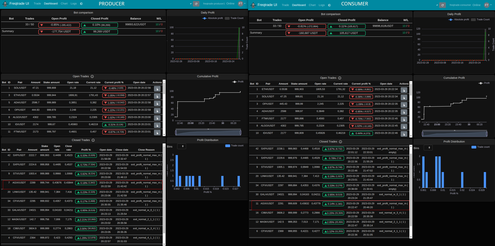

# FreqTrade consumer/producer strategy

> /!\\ Experimental

## The idea

This is an experimental strategy for FreqTrade that uses a producer/consumer model to run one strategy over a large number of pairs. Producers generate dataframes for a set of pairs, and the consumer handles multiple pairs with dataframes from producers. The consumer buys and sells based on the producer's signals and executes callbacks using the producer's data.

The main advantage would be the ability to run multiple bots while having only one configuration for max_open_trades and stake_amount. This would allow for the full potential of the wallet to be used.

Ex:

* Producer 1: generate dataframe for 50 paires (  0 to  49)
* Producer 2: generate dataframe for 50 paires ( 50 to  99)
* Producer 3: generate dataframe for 50 paires (100 to 149)
* **Consumer**: handle 150 paires with dataframe (and signals) from producers




## How it work

Strategy auto-detect if is producer or consumer through the config `external_message_consumer.producers`. If has at least 1 producer, it's a consumer.


### Producer

It works as any others strategies.


### Consumer

* All producers' paires in whitelist (config.json)
* For each paires look for all producers until it find the producer who has the dataframe
* Use that dataframe as its own (should merge ? Did not manage to make it work)
* Buy from the producer's dataframe signals until `config.max_open_trades` with `config.stake_amount`
* Sell from the producer's dataframe signals
* If the strategy uses some callbacks (`confirm_trade_entry`, `confirm_trade_exit`, `custom_exit`, ...) the consumer will execute the code for these callbacks using the dataframe provided by the producer. For these callbacks, the value returned by the producer is ignored. If it is not included in the producer's dataframe, the consumer will not be aware of it.


## Limitations

* In `populate_indicators_from_producers` we must list all indicators used in the strategy in `required_columns`. When starting the bot with active trade, strategy callbacks that use indicators are going to throw errors.
* `forceexit` on producers won't forceexit on consumer
* `forceentry` on producers won't forceentry on consumer (not fully tested)
* `rebuy` on producers won't rebuy on consumer (not fully tested)
* The consumer always starts a trade for all active trades of the producers. The consumer does not clear the entry signal


## Bug

### Unsync exit from callback

With the ProducerConsumerNFIX2AutoBuyEverything strategy, the exit signal is generated in the `custom_exit` callback, and the consumer uses the data frame provided by the producers to execute that callback. However, we can observe that the decisions of the producers and the consumer to close a trade or not are not synchronized.

> Sometime the producer close a trade but not the consumer.

> Sometime the consumer close a trade but not the producer. (This is problematic)

**Combined with the fact that the consumer always starts a trade for all active trades of the producers, this becomes a huge problem**. The consumer will restart the trade for the same pair. This will result in a trade that is most likely a bad decision.

There is 3 possible solutions:
  * Producers signals needs to be cleared
  * Consumer need to know how old is the signal and depending how old is the signal is ignore it (tried `ignore_buying_expired_candle_after` but producers dataframe still contains `entry_signal` )
  * Improve dataframe merge on the consumer side (??)


## Strategies files

* `ProducerConsumerNFIX2AutoBuyEverything.py`: is a "working" strategy adapted to use the producer/consumer mode.

* `ProducerConsumerStrategy.py`: is only the code that I added to the strategy to make it work with the producer/consumer mode, easier to read and understand.


## Run the test strategy

``` bash
# CONSUMER if you want to run more than 1 producer update config.json (paires whitelist and producers list):
freqtrade trade --config user_data/config.json --userdir user_data --strategy ProducerConsumerNFIX2AutoBuyEverything

# PRODUCERS:
freqtrade trade --config user_data/config-producer-1.json --userdir user_data --strategy ProducerConsumerNFIX2AutoBuyEverything
# freqtrade trade --config user_data/config-producer-2.json --userdir user_data --strategy ProducerConsumerNFIX2AutoBuyEverything
# freqtrade trade --config user_data/config-producer-3.json --userdir user_data --strategy ProducerConsumerNFIX2AutoBuyEverything
```
