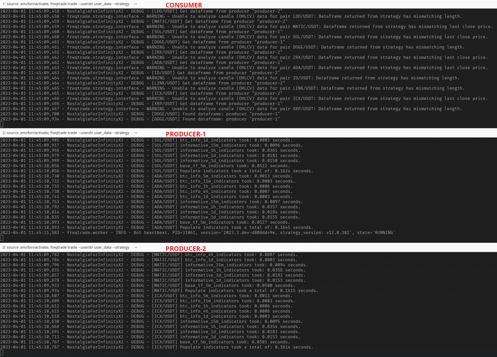

# FreqTrade consumer/producer strategy

> **/!\\ Experimental**

## The idea

This is an experimental strategy for FreqTrade that uses a producer/consumer model to run one strategy over a large number of pairs. Producers generate dataframes for a set of pairs, and the consumer handles multiple pairs with dataframes from producers. The consumer buys and sells based on the producer's signals and executes callbacks using the producer's data.

The main advantage would be the ability to run multiple bots while having only one configuration for max_open_trades and stake_amount. This would allow for the full potential of the wallet to be used.

Ex:

* Producer 1: generate dataframe for 50 paires (  0 to  49)
* Producer 2: generate dataframe for 50 paires ( 50 to  99)
* Producer 3: generate dataframe for 50 paires (100 to 149)
* **Consumer**: handle 150 paires with dataframe (and signals) from producers




## How it work

Strategy auto-detect if is producer or consumer through the config. If has at least 1 producer, it's a consumer.

```json
{
  "external_message_consumer": {
    "enabled": true,
    "producers": [
      {
        "name": "producer-1", // Required & unique
        "host": "127.0.0.1",
        "port": 8081,
        "secure": false,
        "ws_token": "super-secret-str-1"
      }
      // Other producers...
    ]
  }
}
```

### Producer

It works as any others strategies.


### Consumer

* All producers' paires in whitelist (config.json)
* For each paires look for all producers until it find the producer who has the dataframe
* Use that dataframe as its own (should merge ? Did not manage to make it work)
* Buy from the producer's dataframe signals until `config.max_open_trades` with `config.stake_amount`
* Sell from the producer's dataframe signals
* If the strategy uses some callbacks (`confirm_trade_entry`, `confirm_trade_exit`, `custom_exit`, ...) the consumer will execute the code for these callbacks using the dataframe provided by the producer. For these callbacks, the value returned by the producer is ignored. If it is not included in the producer's dataframe, the consumer will not be aware of it.


## Limitations

* `forceexit` on producers won't forceexit on consumer
* `forceentry` on producers won't forceentry on consumer
* `rebuy` on producers won't rebuy on consumer (not fully tested)


## Observations

### Unsync exit from callback

The NFIX2 strategy do not use `populate_exit_trend` to generate a exit signal in the dataframe, it uses the `custom_exit` callback to handle trade exit. So the consumer won't receive a exit signal. The consumer will uses the data frame provided by the producers to execute the `custom_exit` callback (and others). As a result, we can observe that the decisions of the producers and the consumer to close a trade or not are not synchronized.

> Sometime the producer close a trade before the consumer, sometime it happens the other way around.


## Strategies files

* `DummyConsumerStrategy.py`: as the name suggests, it's a dummy consumer strategy. It's will get the dataframe from the producers and do whateever the signals in the dataframe says.

* [REMOVED] `ProducerConsumerNFIX2AutoBuyEverything.py`: was the source of the bug that made me think that the consumer automatically buys for all producers' active trades. In fact, that strategy (producer side) was buying everything and everytime. So there were always a buy_signal produced.


## Run the test strategy

``` bash
# CONSUMER if you want to run more than 1 producer update config.json (paires whitelist and producers list):
freqtrade trade --config user_data/config-consumer.json --strategy DummyConsumerStrategy

# PRODUCERS:
freqtrade trade --config user_data/config-producer-1.json --strategy SomeStrategyThatGenerateDataFrameWithBuySellSignals
# freqtrade trade --config user_data/config-producer-2.json --strategy SomeStrategyThatGenerateDataFrameWithBuySellSignals
# freqtrade trade --config user_data/config-producer-3.json --strategy SomeStrategyThatGenerateDataFrameWithBuySellSignals
```

> I made a fork of the NFIX2 where I added the code to use producer/consumer mode. **/!\\ I do not guarantee that I will keep the fork up to date. Do not use it live**

> https://github.com/matthieu-hm/NostalgiaForInfinity
